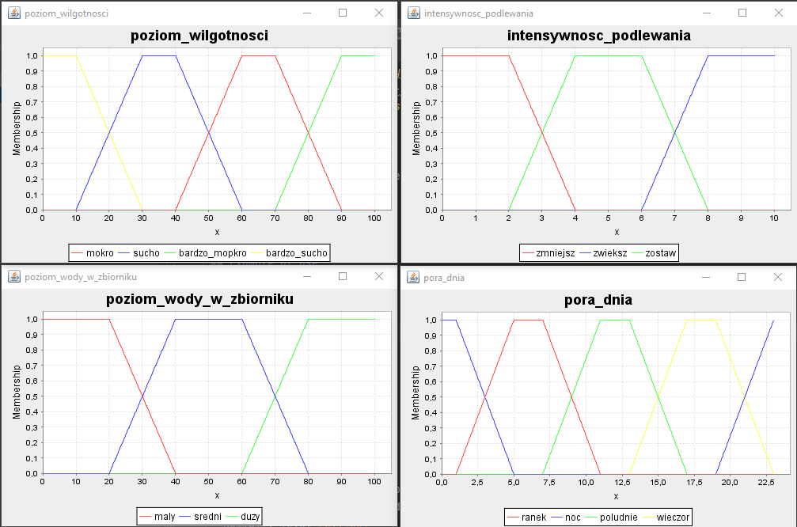
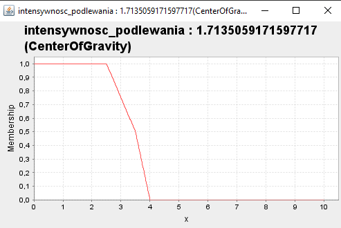
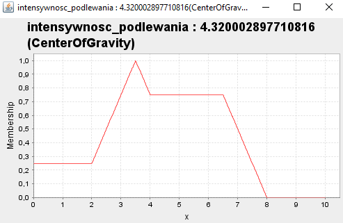
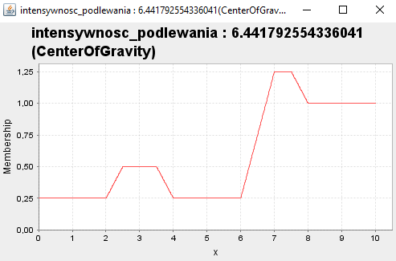
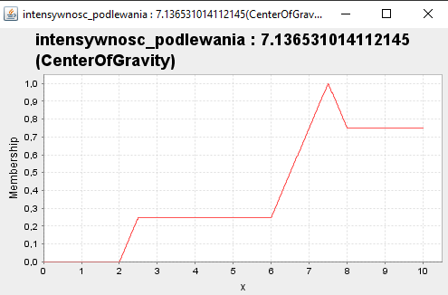

<h1 align="center"> Watering Driver </h1> <br>

## Spis treści
* [Watering Driver](#watering-driver)
* [Example of use](#example-of-use)
* [Technologies](#technologies)
* [Setup](#setup)

## Watering Driver
This project controls the intensity of watering in a fuzzy manner depending on 3 parameters:
- humidity
- time of day
- water level in the tank

## Example of use
In `driver.fcl` there are drivers setup and rules.


If we reduce the humidity, the result will increase
<br />
```driver.fcl 90 8 80```
<br />

<br />
```driver.fcl 50 8 80```
<br />

<br />
```driver.fcl 20 8 80```
<br />

<br />
```driver.fcl 10 8 80```
<br />

<br />

## Technologies
- jFuzzyLogic-1-2-1


## Setup
Run a .jar file with the following arguments
- input data file - driver code `.fcl`
- humidity level [0..100]
- time of day [0..23]
- water level [0..100]

``` 
java -jar FuzzyLogic.jar [input data file] [humidity level] [time of day] [water level]
```
